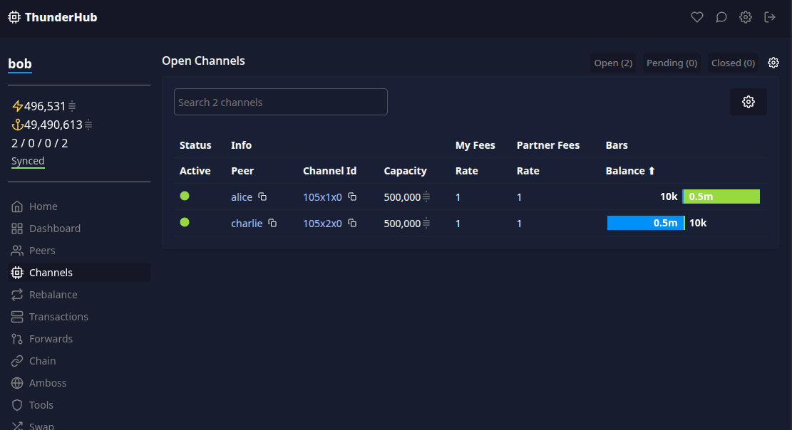

# LND Playground

I developed this project while I was learning about the [Lightning Network Daemon (lnd)](https://github.com/lightningnetwork/lnd), and I think it might help other people with their first steps as well.

It is intended to be used by IT professionals that want to get familiarized with lnd.

## Usage

To start it, clone the repository and run the start script:

    ./start.sh

This script assumes that the current user is able to run docker, so you might need sudo depending on your local setup:

    sudo ./start.sh

The script does the following:

-   Starts a Bitcoin node running on regtest network
-   Starts three lnd nodes (lnd-alice, lnd-bob and lnd-charlie)
-   Mine Bitcoins
-   Creates wallet for each lnd node
-   Transfers Bitcoins to each lnd node
-   Creates a channel from Alice to Bob, and from Bob to Charlie
-   Creates an invoice from Charlie's node
-   Pays Charlie's invoice from Alice's node, forwarding the payment through Bob's node
-   Initialize a Thunderhub instance pre-configured with the three lnd nodes

After the that the nodes remain active, and can be used for further testing.

